<p align="center">
  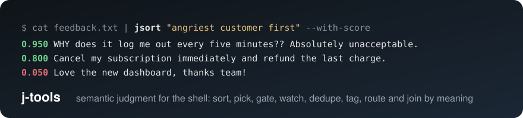
</p>

<p align="center">
  <a href="https://github.com/adiel-hub/Jtools/actions/workflows/ci.yml"></a>
  <a href="https://pypi.org/project/jev-tools/"></a>
  
  <a href="LICENSE"></a>
  
</p>

# j-tools

**Semantic judgment for the shell.** Ten small Unix tools that sort, pick, gate, watch, dedupe,
tag, route and join text **by meaning**. Each does one decision job and pipes into the next,
exactly like `grep`, `sort`, `uniq` and `head`. The difference: the criterion is a sentence, and
the decision is made by [Jev](https://docs.typesafe.ai), TypeSafe's decision model, in about
<!--num:latency_p50_round-->420 ms<!--/num--> for about a thousandth of a cent.

```console
$ cat feedback.txt | jsort "angriest customer first" --with-score
0.950	WHY does it log me out every five minutes?? Absolutely unacceptable.
0.800	Cancel my subscription immediately and refund the last charge. Worst support ever.
0.700	Your sales rep promised a feature that does not exist. I feel lied to.
0.050	Love the new dashboard, thanks team!

$ tail -f app.log | jwatch "something a human should look at right now" --cooldown 300
2026-09-18T10:00:05Z ERROR api    payment-svc unreachable, 3 retries exhausted, order 88213 not charged

$ git diff | jgate "this change is safe to auto-merge" && git merge
$ cat inbox.txt | jroute "sales:a sales lead" "support:a support request" "spam:junk" --out-dir sorted
```

<p align="center">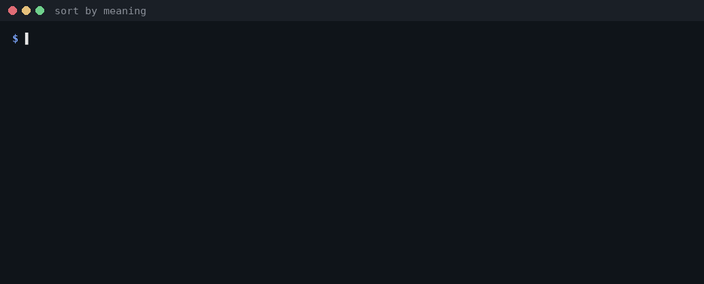</p>

Jev is **not a text generator**. It takes a state (text or JSON) and typed questions, and returns
typed answers with calibrated probabilities. Nothing here ever asks a model to write anything.
That is the whole design, and it is what makes these tools fast enough and cheap enough to sit
in a pipe.

<p align="center">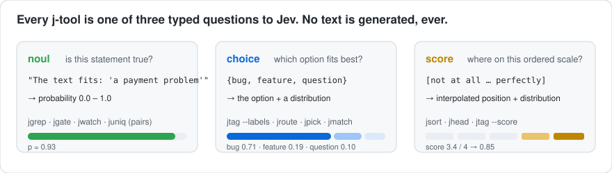</p>

## The ten tools

| tool | one decision job | primitive | try it |
|---|---|---|---|
| [`jgrep`](docs/tools/jgrep.md) | print lines that fit a description | noul | `tail -f app.log \| jgrep "a user is getting frustrated"` |
| [`jsort`](docs/tools/jsort.md) | sort lines by how well they fit | score | `cat tasks.txt \| jsort "most urgent" -n 10` |
| [`jpick`](docs/tools/jpick.md) | choose the single best line | choice | `cat subject-lines.txt \| jpick "most likely to get opened" --why` |
| [`jgate`](docs/tools/jgate.md) | exit status from a judgment; guards `&&` | noul | `cat report.txt \| jgate "mentions a security incident" && alert` |
| [`jwatch`](docs/tools/jwatch.md) | alert only on lines worth attention, live | noul | `journalctl -f \| jwatch "a service is failing repeatedly" --exec 'notify-send {}'` |
| [`juniq`](docs/tools/juniq.md) | drop lines that mean the same as an earlier one | noul × pairs | `cat requests.txt \| juniq "same underlying request" -c` |
| [`jhead`](docs/tools/jhead.md) | the N most relevant lines, in original order | score | `cat thread.txt \| jhead 5 "the key decisions made"` |
| [`jtag`](docs/tools/jtag.md) | add a label or score column, nothing dropped | choice / score | `cat tickets.txt \| jtag --labels "bug,feature,question"` |
| [`jroute`](docs/tools/jroute.md) | split a stream into bucket files | choice | `cat inbox.txt \| jroute "sales:a lead" "spam:junk" -o sorted` |
| [`jmatch`](docs/tools/jmatch.md) | semantic join: for each line in A, the best in B | choice | `jmatch invoices.txt payments.txt "same transaction"` |

Plus [`jtools`](docs/tools/jtools.md) (`list`, `doctor`). Every tool reads stdin or files, writes
stdout, preserves input order unless its job is to reorder, streams (`tail -f` works), and shares
one set of flags and exit codes. More pipelines in [docs/recipes.md](docs/recipes.md).

<details>
<summary><b>Real output from each tool</b> (recorded, not typed; click to expand)</summary>

| | |
|---|---|
| 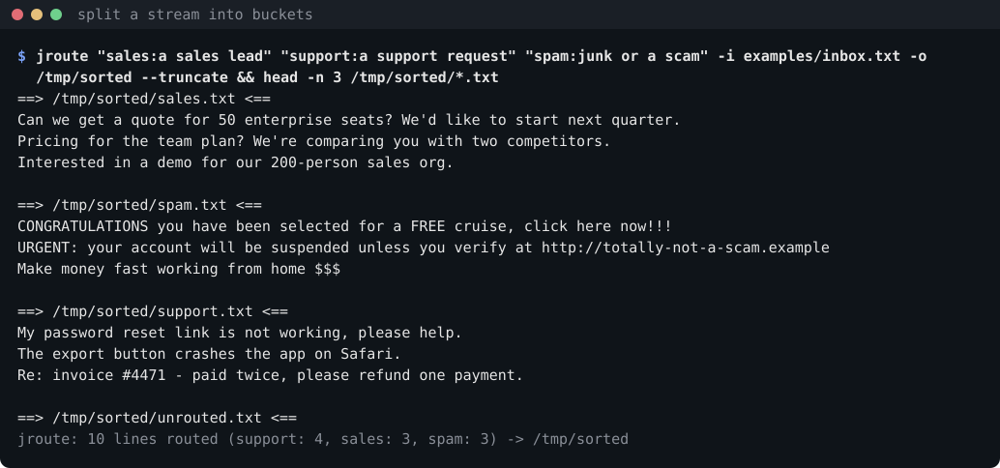 | 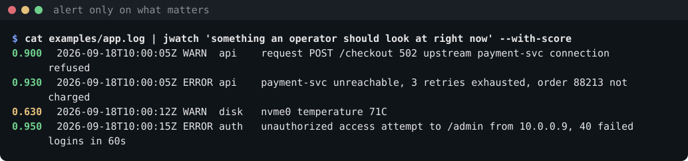 |
| 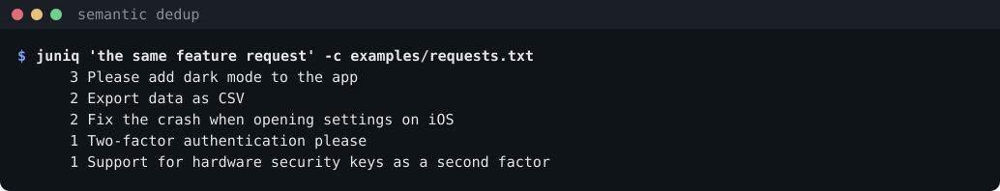 | 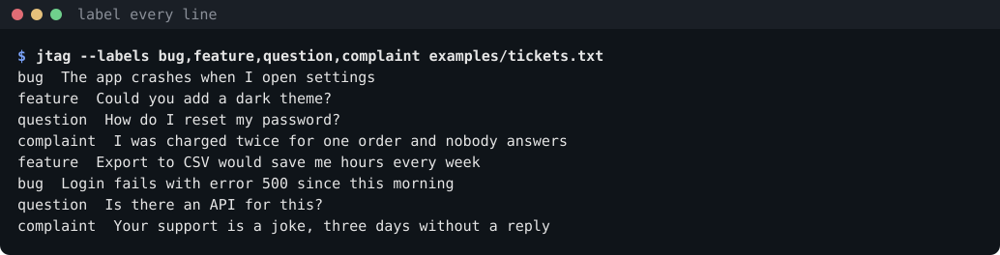 |
| 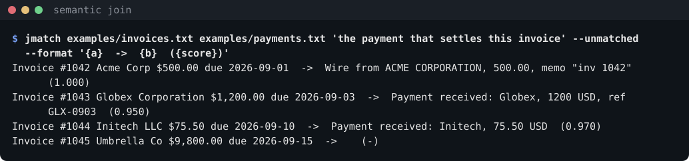 | 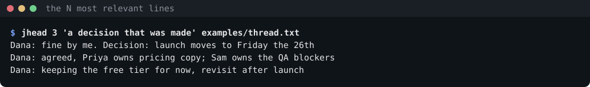 |
| 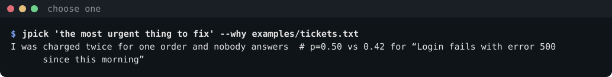 |  |
| 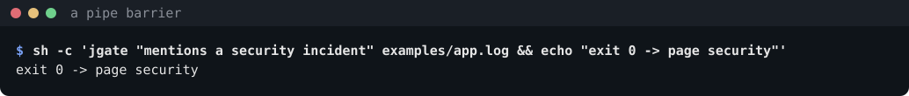 | |

Animated versions: `docs/assets/demo-*.gif`; asciinema casts: `docs/demo/*.cast`.
</details>

## Install

```bash
uv tool install git+https://github.com/adiel-hub/Jtools   # all eleven commands, straight from main
uv tool install jev-tools                                 # once the first release is on PyPI
```

Python 3.11+. One dependency (`httpx`). Then one key, any of these:

| backend | key | get one |
|---|---|---|
| TypeSafe (native) | `TYPESAFE_API_KEY` | [console.typesafe.ai](https://console.typesafe.ai/settings/keys) |
| OpenRouter | `OPENROUTER_API_KEY` | [openrouter.ai/keys](https://openrouter.ai/keys) |
| Vercel AI Gateway | `AI_GATEWAY_API_KEY` (`vck_…`) | [vercel.com/ai-gateway](https://vercel.com/ai-gateway) |
| your own System One gateway | `JEV_GATEWAY_URL` + `JEV_GATEWAY_API_KEY` | LiteLLM, a corporate proxy, a mock |

With several keys the first in that order wins; force one with `--api NAME` or `JEV_API`. Keys can
also live in `~/.config/jev/typesafe.key`, `openrouter.key`, `vercel.key`, `gateway.key` (+ `gateway.url`).

Shell completions for all eleven commands are in [`completions/`](completions/):

```bash
source completions/j-tools.bash            # bash
cp completions/_jtools ~/.zfunc/ && echo 'fpath+=~/.zfunc' >> ~/.zshrc   # zsh
```

```console
$ jtools doctor
using vercel at https://ai-gateway.vercel.sh/v4/ai/evaluation-model with key vck_…9f2a, model typesafe-ai/jev
ok: one call in 412 ms, 283 input tokens, $0.0000119, answered by typesafe-ai/jev
```

## Where this sits

| | **j-tools** | `lx` and other LLM shell wrappers | `grepai`, `ck` and other embedding search |
|---|---|---|---|
| what the model does | **judges**: yes/no, pick one, rate on a scale | **generates** text: summaries, commands, rewrites | **compares vectors**: nearest neighbours |
| output | calibrated probabilities, labels, ranks, exit codes | prose | similarity scores |
| "angriest customer first" | yes, that is a rubric | you get a paragraph about anger | no, anger is not a similarity |
| per line | ~<!--num:latency_p50_round-->420 ms<!--/num-->, ~<!--num:dollars_per_call-->$0.000013<!--/num--> (measured below) | a round trip plus generated tokens, <!--num:cost_ratio_range-->3.8-130.9x the cost<!--/num--> | fast after indexing; needs an index |
| composes with `&&`, `sort`, `head` | yes, by design | awkwardly | no |
| failure mode | pass-through + exit 5; gate fails closed | hallucinated text | silent misses |

**The calibrated judgment layer for the shell.** Generation is `lx`'s job; similarity is
`grepai`'s. We judge, rank, classify, gate and route, and refuse to do anything else
([CONTRIBUTING.md](CONTRIBUTING.md) has the Hard Rule).

## Numbers

All measured with the installed commands against a real endpoint, uncached; scripts and raw
results are in [`bench/`](bench/). Details and method notes: [docs/benchmarks.md](docs/benchmarks.md).

<p align="center">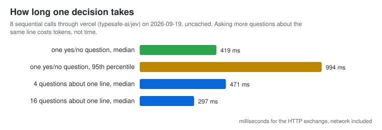</p>

<p align="center">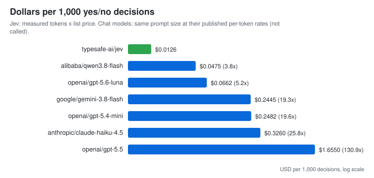</p>

<p align="center">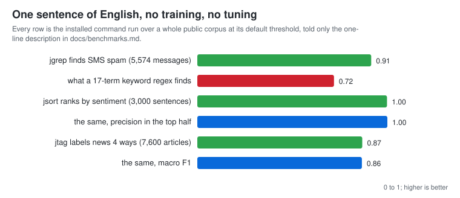</p>

<!-- BEGIN bench-summary (generated by scripts/update_docs.py; do not edit) -->

- **Latency:** 419 ms median per decision end to end (p95 994 ms), measured through vercel; asking 16 questions about the same line costs about the same time as one.
- **Cost:** 301 input tokens and $0.000013 per decision, $0.0126 per 1,000.
- **vs chat models:** the same yes/no decision costs 3.8x to 130.9x more at list price (qwen3.8-flash, gpt-5.6-luna, gemini-3.8-flash, …). Their latency is not measured here; see the method notes.
- **Accuracy, from a one-line description, with no tuning:** `jgrep` finds SMS spam with F1 1.00 (n=30), where a 17-term keyword regex scores 0.29 on the same 30 messages; `jsort` ranks review sentiment with AUC 0.76 (n=20); `jtag` labels AG News four ways with 50% accuracy (n=20).

<!-- END bench-summary -->

Every number above comes from a result file in [`bench/results/`](bench/results/); the full tables
and the method notes are in [docs/benchmarks.md](docs/benchmarks.md).

Two structural facts behind the numbers: Jev answers every question about one state **in one
call** (so `jgrep -e a -e b -e c` and `juniq`'s 50 pair questions cost tokens, not time), and Jev
charges for **input tokens only** (about <!--num:tokens_per_call_round-->300<!--/num--> per line;
a million lines is about <!--num:dollars_per_million-->$13<!--/num--> at list price).

## Common options

Every tool:

```
-p P             probability needed for a positive verdict (default 0.5)
--json           one JSON object per record, with scores and probabilities
--dry-run        print the backend, the exact questions and a redacted input sample; send nothing
--model ID       pin a model (default: the backend's latest Jev alias)
--api NAME       typesafe | openrouter | vercel | gateway
-j N             requests in flight (default 20, or $JEV_CONCURRENCY)
--timeout SEC    per request once it starts, retries and rate-limit waits included, but not
                 time spent queued behind -j (default 15, or $JEV_TIMEOUT)
--budget USD     stop at this spend (default 1.00, or $JEV_BUDGET; 0 = no limit)
--max-chars N    judge only the first N characters of a record (default 8000)
--no-cache       do not read or write ~/.cache/jev/answers.sqlite
--strict         fail closed: stop with exit 4 on the first API error
--color MODE     auto | always | never
--stats          calls, cached, tokens, dollars, p50 latency on stderr (default: when stderr is a TTY)
-q               no end-of-run notes on stderr; errors are still reported
-v               one line on stderr per decision, as it is made
```

`jgrep` keeps grep's `-q` instead: print nothing, stop at the first match, let the exit status be
the answer. It also keeps grep's `-v` for invert-match, and spells the shared one `--verbose`.

Exit codes: **0** ok · **1** nothing matched · **2** usage or file error · **3** no or bad key ·
**4** API error or budget spent · **5** partial (some lines could not be judged and passed through).

## How it works

<p align="center">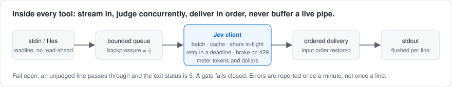</p>

- **Batching.** All questions about one state travel in one request.
- **Concurrency.** A semaphore bounds requests in flight (`-j`, default 20); the reader never runs
  far ahead of judging, so `tail -f` never buffers and a 10 GB file never loads.
- **Caching.** Identical (model, state, question) is judged once per run, and once across runs in
  `~/.cache/jev/answers.sqlite` (shared by all tools in a pipeline). Answers are stored under the
  model version that produced them, never under a moving alias like `jev-latest`, so a rerun
  spends one call to see what the alias means today and reads the rest from disk. Pin `--model`
  and a rerun costs nothing at all.
- **Fail-open.** An API error means a line passes through unjudged, the run continues, the exit
  status becomes 5, and the error is reported once a minute. `--strict` fails closed. `jgate`
  fails closed by default, because a gate that opens during an outage is not a gate.
- **Rate limits.** A 429 brakes every request in the client, and for the next two minutes requests
  go out one at a time instead of as a burst. Nothing fans out. A request waits the brake out when
  `--timeout` allows; when the backend asks for longer than that, the request says so immediately
  rather than sleeping out its whole deadline and reporting nothing useful.
- **Budget.** `--budget` (default $1) stops a run before it costs more than you meant. The cost of
  a call is reserved when it starts, not billed when it ends, so twenty requests in flight cannot
  all clear the last dollar between them.
- **Two wire formats, one library.** `jevcore` speaks TypeSafe's System One API (also OpenRouter and
  gateways) and the Vercel AI Gateway's evaluation modality; every tool sees typed answers only.

`jevcore` is importable on its own:

```python
from jevcore import Jev, Noul, Choice, Score, resolve

async with Jev(resolve()) as jev:
    a = await jev.ask("checkout failed three times, I am done", {
        "angry":   Noul("The writer is frustrated."),
        "route":   Choice("Route this ticket.", {"billing": "payments", "bug": "defects"}),
        "urgency": Score("How urgent is this?", ["low", "medium", "high"]),
    })
    a["angry"].probability, a["route"].choice, a["urgency"].normalized   # 0.97, "bug", 0.93
```

More in [docs/architecture.md](docs/architecture.md).

## Things to know

- These are a model's judgments. Check a sample before you rely on a filter. Borderline lines get
  probabilities in the middle; that is what `-p` is for.
- Jev answers the description you wrote, not the one you meant. TypeSafe
  [documents](https://docs.typesafe.ai/model-jaggedness/jev-1.13) weak spots: counting, comparing
  numbers or dates, double negatives, long inputs full of irrelevant detail.
- Near-deterministic, not exactly: uncached probabilities can move by a few hundredths. Pin
  `--model jev-1.13.0` and keep the cache for exact reruns.
- Text in the input can try to steer the answer. **Not a security boundary.**
- Free-tier gateways throttle hard; set `JEV_TIMEOUT=600` and `-j 2` and let the tools wait.

More in [docs/faq.md](docs/faq.md).

## Development

```bash
git clone https://github.com/adiel-hub/Jtools && cd Jtools
uv sync --all-groups
uv run pytest -q -m "not live"         # the offline suite against MockJev, no key needed
uv run pytest -q -m live               # one real call per tool, with any key set
uv run ruff check src tests && uv run ruff format --check src tests && uv run mypy src
```

The mock speaks both wire formats and runs as a real localhost endpoint for subprocess tests, so
streaming, broken pipes, dead endpoints, ordering under latency and bounded concurrency are all
covered without a key. [CONTRIBUTING.md](CONTRIBUTING.md) has the layout, the rules and the
list of tools we deliberately do not build.

## Acknowledgements

The idea of a shell tool whose pattern is a description, and the key/gateway conventions
(`~/.config/jev`, `JEV_API`, `JEV_GATEWAY_URL`), come from Khaled Eltokhy's
[jgrep](https://github.com/keltokhy/jgrep); our `jgrep` is a fresh implementation on the shared
`jevcore` client and interoperates with the same config and cache. Jev is made by
[TypeSafe AI](https://docs.typesafe.ai).

MIT license.
